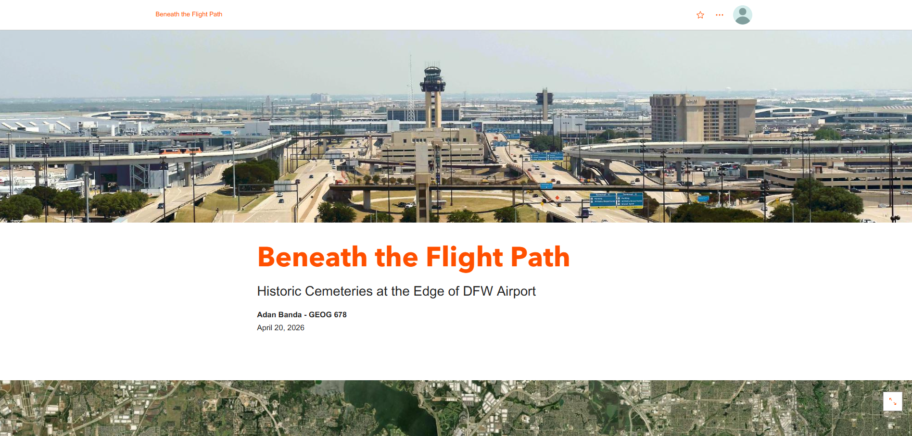
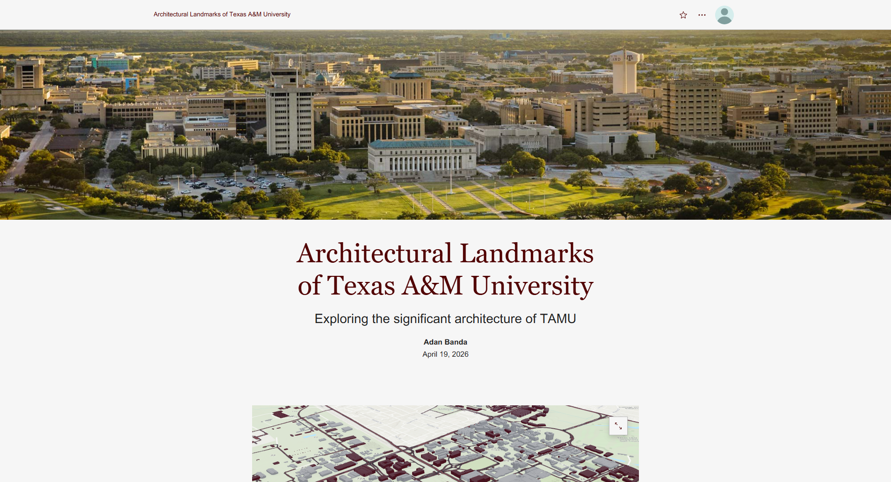

# GEOG 678 – Lab 7 (Adan Banda)

## Overview
This lab demonstrates the use of ArcGIS StoryMaps to create interactive geographic narratives. Two separate story maps were developed: a 2D story map exploring cemetery locations in the Dallas–Fort Worth area, and a 3D story map examining the architectural characteristics of Texas A&M University.

---

## 2D Story Map – Cemeteries in the DFW Area
This story map explores selected cemetery locations across the Dallas–Fort Worth International Airport property. It highlights their geographic distribution, and historical context.

### Story Focus
- Spatial distribution of cemeteries across DFW
- Historical and cultural significance of selected sites
- Use of maps and images to connect place and narrative

### Screenshot

### Link
See `links.txt` for the published Story Map URL.

---

## 3D Story Map – Architecture of Texas A&M University
This story map uses a 3D web scene to explore the architectural landscape of Texas A&M University. It highlights key campus buildings and examines how their design reflects tradition, scale, and modern development.

### Featured Locations
- Academic Building  
- Kyle Field  
- Memorial Student Center  
- Clayton W. Williams, Jr. Alumni Center  

### Story Focus
- Architectural styles across campus  
- Spatial relationships between buildings  
- Differences between historic and modern structures  

### Screenshot

### Link
See `links.txt` for the published Story Map URL.

## Files Included
- `StoryMap_2D.png`
- `StoryMap_3D.png`
- `links.txt`
- `README.md`

## Notes
Both StoryMaps were created using ArcGIS StoryMaps and demonstrate how geographic data, imagery, and narrative can be combined to communicate spatial stories in both 2D and 3D environments.