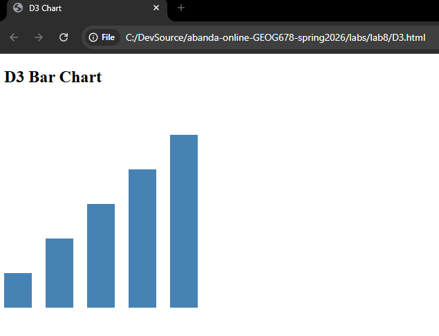
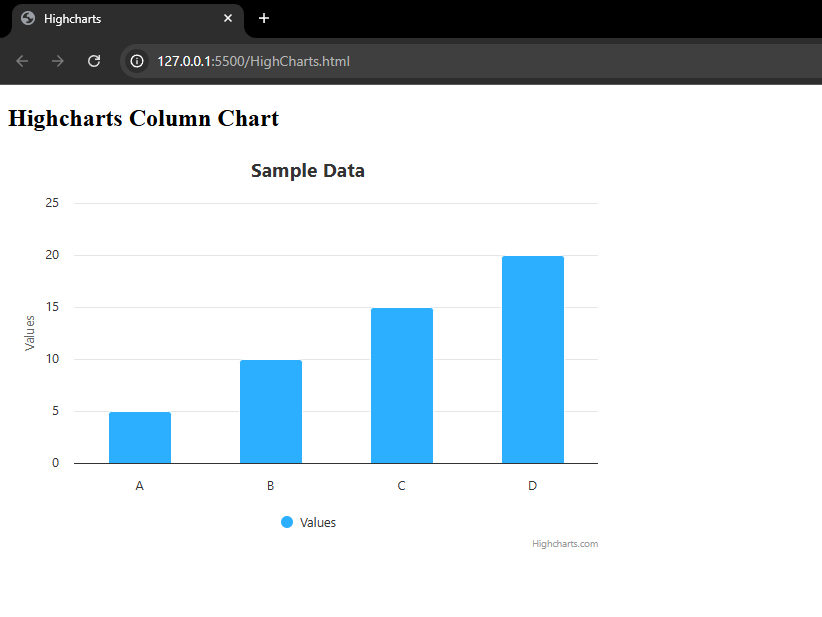
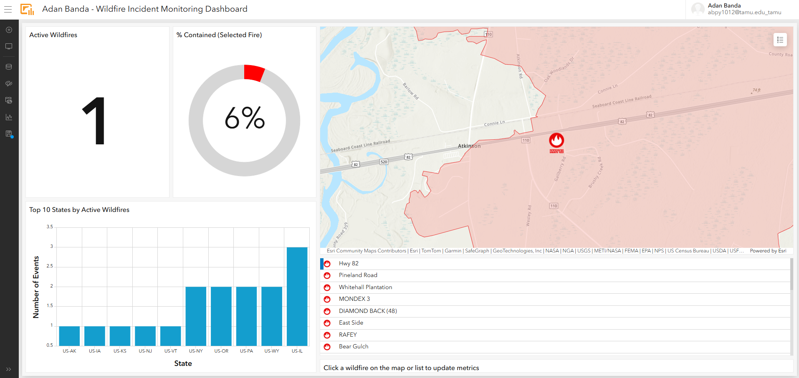

# GEOG 678 – Lab 8: Interactive Charts

## Overview
This lab demonstrates the creation of an operations dashboard and interactive charts using D3.js and Highcharts.

## Operations Dashboard
[View Dashboard](https://www.arcgis.com/apps/dashboards/274ee14f9f2a470296be283830b0809a)

## D3 Chart

## Highcharts Chart
This one was a bit tricky and I needed to install an extension called Live Server so the code could render. The JS library was not functioning under the standard file:// mode. 

## Dashboard

## Files Included
- D3.html
- HighCharts.html
- AdanBanda_WildfireDashboard_Lab8
- AdanBanda_D3.png
- AdanBanda_HighCharts.png
- README.md